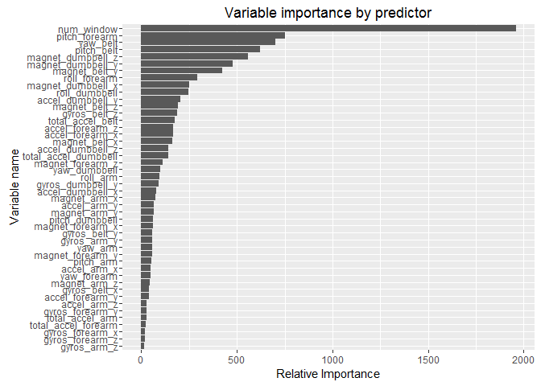
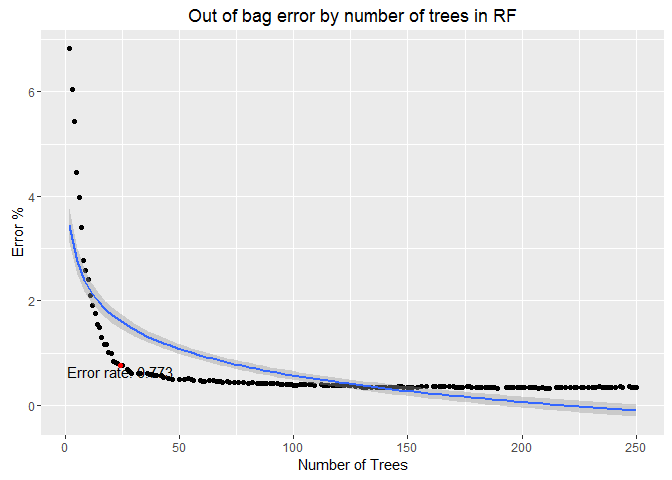
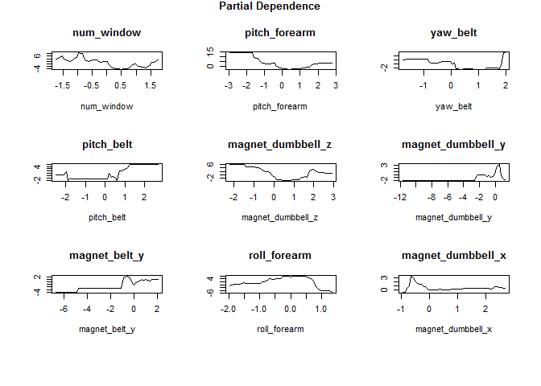

<<<<<<< HEAD
# Predicting quality of physical activity using dumbbell movement
=======
# Predicting quality of physical activity using dumbell movement
>>>>>>> origin/master
Marcelo Szilagyi  
May 30, 2016  
# Summary
Six young health participants were asked to perform one set of 10 repetitions of the Unilateral Dumbbell Biceps Curl in five different fashions: exactly according to the specification (Class A), throwing the elbows to the front (Class B), lifting the dumbbell only halfway (Class C), lowering the dumbbell only halfway (Class D) and throwing the hips to the front (Class E). 
The objective was to create a model capable to predict the classes. 
After testing multiple classifiers methods with a very small sample, a random tree model was adopted to train the dataset. 
The final model had 250 trees with up to 24 variables in each tree and delivered a balanced accuracy of 99.7% in the testing set. 

# Data obtention and cleaning
## Getting Data
I loaded required packages and downloaded the data from indicated website.


```r
# load all packages required to the analysis
require(data.table);require(caret);require(ggplot2);require(proxy);require(RANN); require (RCurl); library(RCurl);require(ggRandomForests)
```


```r
# get data from website. 
options(RCurlOptions = list(cainfo = system.file("CurlSSL", "cacert.pem", package = "RCurl")))   
URL <- "https://d396qusza40orc.cloudfront.net/predmachlearn/pml-training.csv" ; trainingRaw <- getURL(URL)
URL1 <- "https://d396qusza40orc.cloudfront.net/predmachlearn/pml-testing.csv" ; testingRaw <- getURL(URL1)
```
After an initial check, I changed the string during importation in R to exclude "#DIV/0!" results and enforced that most of columns were numeric values, except the variable of interest (factor). I also set the seed for the remainder of the analysis.


```r
set.seed(777)
training <- fread(trainingRaw,na.strings=c("NA","N/A","null",'',"#DIV/0!"))
# checking the variables that are chars and number of unique values per variable
issues  <- sapply((training[,which(sapply(training,mode)!="numeric"),with=FALSE]),function(x)length(unique(x)))
# my decision is to use as numeric for most of the data column 7 to 159
strTmp = names(training)[7:159]
training[, (strTmp) := lapply(.SD, as.numeric), .SDcols = strTmp]
# there were 5 columns left: user_name, new_window and classe are factors; V1 is numeric (index) and ctvd_timestamp is kept as char. 
training$user_name <- as.factor(training$user_name); training$new_window <- as.factor(training$new_window); training$classe = as.factor(training$classe); training$V1=as.numeric(training$V1)

# this "testing" set is really just 20 records for quiz purposes
testing <- fread(testingRaw,na.strings=c("NA","N/A","null",'',"#DIV/0!"))
# checking the variables that are chars and number of unique values per variable
issues  <- sapply((testing[,which(sapply(testing,mode)!="numeric"),with=FALSE]),function(x)length(unique(x)))
# my decision is to use as numeric for most of the data column 7 to 159
strTmp = names(testing)[7:159]
testing[, (strTmp) := lapply(.SD, as.numeric), .SDcols = strTmp]
# there were 5 columns left: user_name, new_window and classe are factors; V1 is numeric (index) and ctvd_timestamp is kept as char. 
testing$user_name <- as.factor(testing$user_name); testing$new_window <- as.factor(testing$new_window); testing$V1=as.numeric(testing$V1)
```
## Split into training, test and validation sets 

The size of the testing set (20 cases) is too small for a real testing set. 
I decided to split the training set provided into 3 testing sets: training, testing and validation. 
I took a small portion of the training set and used to crate a small "play" set.
I will use this small "play" set (5% of the training set or ~ 588 cases ) to run multiple classification methods/algorithms and based on accuracy, define the method that I will apply for the training set.


```r
 trainingRows<-createDataPartition(training$classe, p=0.60, list=FALSE) # creating training set
 mytrain <- training[c(trainingRows)] 
 mytestandvalidation <- training[c(-trainingRows)] # the rest is either test or validation
 testingRows<-createDataPartition(mytestandvalidation$classe, p=0.50, list=FALSE) # create test set
 mytest <- mytestandvalidation[c(testingRows)]
 myvalidation <- mytestandvalidation[c(-testingRows)] # create validation set
 smallRows<-createDataPartition(mytrain$classe, p=0.05, list=FALSE)  # small set to play with models
 small <- mytrain[c(smallRows)]
```

I excluded from analysis the variables with more than 90% of data with NAs.   
After that, I excluded an index variable (V1), user name and time stamps. 
Finally, I excluded low variance cases and high correlated variables.  
I created a function that runs that for future usage on other sets.  


```r
CleaningPred <- function(x) { 
# identify variables with more than 90% of NAs
TooMuchNas = sapply(x, function(x) sum(is.na(x))) / sapply(x, function(x) length(x));  
TooMuchNasNames = names(which(TooMuchNas>0.90))
# remove near zero variances - less than 10 unique values and 95% of samples with the same value (caret defaults)
Zerovar <- nearZeroVar(x[,-TooMuchNasNames, with=FALSE], saveMetrics= F); ZeroVarNames =  names(x[,Zerovar, with=FALSE])
numericFieldsNames <- names(which((sapply(x[,!c(ZeroVarNames,TooMuchNasNames),with=F], is.numeric))==TRUE))
# remove high variance cases  - 0.9 of correlation (caret default)
HighCorIndex  <-  (findCorrelation(cor(x[ , numericFieldsNames, with=FALSE])))
HighCorNames  <-  names(x[ , numericFieldsNames, with=FALSE][,HighCorIndex, with=FALSE])
# identify all variable names that are NAs, zero variance or high correlated
AllBadNames  <-  c(ZeroVarNames,TooMuchNasNames,HighCorNames); AllNames=names(x)
GoodNames  <-  AllNames[!AllNames%in%AllBadNames]
# remove V1, timestamps, user name
GoodNames  <-  GoodNames[!GoodNames%in%c( "V1","user_name","raw_timestamp_part_1","raw_timestamp_part_2","cvtd_timestamp","classe")]
return(GoodNames)
}
# use method in the play set 
smallNames = CleaningPred(small) 
```
# Data Analysis

##Testing of multiple models in the play set:

I tested multiple models in the small set to reduce all the possible options to few. I used the *dissimilarity* concept presented in the caret  http://topepo.github.io/caret/similarity.html to select models that were not part of the same cluster and started with the "glmnet" method (generalized multinomial logit model). The code in the referenced site creates the most dissimilar models that are able to handle classification problems.


```r
# code and csv the site http://topepo.github.io/caret/similarity.html 
tag <- read.csv("tag_data.csv", row.names = 1)
tag <- as.matrix(tag)
# Select only models for regression
regModels <- tag[tag[,"Classification"] == 1,]

all <- 1:nrow(regModels)
# Seed the analysis with the glm model
start <- grep("(glmnet)", rownames(regModels), fixed = TRUE)
pool <- all[all != start]
n = 10

# Select 4 model models by maximizing the Jaccard
# dissimilarity between sets of models
nextMods <- maxDissim(regModels[start,,drop = FALSE],
                      regModels[pool, ],
                      method = "Jaccard",
                      n = n)

somemodels = rownames(regModels)[c(start, nextMods)]
```

Based on the results above, I trained the small set with the multiple models and plot the accuracy for a final selection. 
Models that did not present a result due to errors -  library not available, dependencies with error, error in the results -  were replaced by the next available choice.  

Additionally, based on http://jmlr.org/papers/volume15/delgado14a/delgado14a.pdf, I added the "parRF" (parallel random forest) model. 
The preprocessing includes knn to populate NA's, scaling and centering. To improve performance, I reduced the cross validations from 25 to 10.


```r
control <- trainControl(method = "cv",number = 10,allowParallel = TRUE) # for fast selection of potential models, set cross validation for 10 folds
preProcValues <- preProcess(small[,smallNames,with=FALSE], method = c("center", "scale", "knnImpute"))
trainTransformed <- predict(preProcValues, small[,smallNames,with=FALSE])
# testTransformed <- predict(preProcValues, test)
mod01 = train(y = small$classe, x=trainTransformed, trControl=control, method = "glmnet")
mod02 = train(y = small$classe, x=trainTransformed, trControl=control, method = "svmRadialSigma")
mod03 = train(y = small$classe, x=trainTransformed, trControl=control, method = "pcaNNet", trace=FALSE)
mod04 = train(y = small$classe, x=trainTransformed, trControl=control, method = "bdk")
mod05 = train(y = small$classe, x=trainTransformed, trControl=control, method = "J48")
mod06 = train(y = small$classe, x=trainTransformed, trControl=control, method = "ranger")
mod07 = train(y = small$classe, x=trainTransformed, trControl=control, method = "fda")
mod08 = train(y = small$classe, x=trainTransformed, trControl=control, method = "rf")
mod09 = train(y = small$classe, x=trainTransformed, trControl=control, method=  "parRF")

summarySmallMethod = vector();summarySmallConfusion = vector(); summarySmallModName = vector()

for (i in 1:9) {
  lmod = ls(pattern="^mod")[i]
  summarySmallModName[i] = lmod
  summarySmallMethod[i] = get(lmod)$method
  summarySmallConfusion[i] = sum(diag(confusionMatrix(get(lmod))$table))}

knitr::kable(data.table(Model = summarySmallModName, 
                        Method = summarySmallMethod, 
                        Accuraccy = round(summarySmallConfusion,1)))
```


Model   Method            Accuraccy
------  ---------------  ----------
mod01   glmnet                 62.9
mod02   svmRadialSigma         65.0
mod03   pcaNNet                57.0
mod04   bdk                    36.7
mod05   J48                    71.1
mod06   ranger                 88.3
mod07   fda                    62.9
mod08   rf                     86.8
mod09   parRF                  86.3

The model I adopted for modeling was the parRF as it delivered an accuracy above 85% for this very small set (one of the top 3 performers) and is the one recommended by the classifier review paper mentioned above. 

## Using the parRF in training, testing and validation sets:

The next part of the code executes the training for 60% of the original training set and predicts for the validation set. The expected result is a similar accuracy or higher. Instead of using a 10 cross fold validation, I reversed to the caret default: 25 cross validations. 


```r
# remove useless variables using the same logic presented above 
smallNames = CleaningPred(mytrain) 
# pre processing
preProcValues <- preProcess(mytrain[,smallNames,with=FALSE], method = c("center", "scale", "knnImpute")) 
# transform variables
trainTransformed <- predict(preProcValues, mytrain[,smallNames,with=FALSE]) 
# run the model
mod12 = train(y = mytrain$classe, x=trainTransformed, method=  "parRF") 
```

```
## Warning: executing %dopar% sequentially: no parallel backend registered
```

```r
treeuse  = data.frame(mytrain$classe,trainTransformed) #for future use
```


```
##           Reference
## Prediction    A    B    C    D    E
##          A 1116    3    0    0    0
##          B    0  755    2    0    0
##          C    0    1  682    6    0
##          D    0    0    0  637    0
##          E    0    0    0    0  721
```

The results of the model are very positive. For a total of 3923 cases, the model just predicts incorrectly 12 cases. As it is unreasonable to expect better performance, I applied the same model to my testing set (not the 20 cases.)


```r
testTransformed <- predict(preProcValues, mytest[,smallNames,with=FALSE])
predictMyTest = predict(mod12,testTransformed)
CMMytest = confusionMatrix (predictMyTest,mytest$classe)
Accuracy = round(CMMytest$overall[1],5)
CMMytest$table
```

```
##           Reference
## Prediction    A    B    C    D    E
##          A 1114    4    0    0    0
##          B    0  753    3    0    0
##          C    0    1  681    4    0
##          D    0    0    0  639    1
##          E    2    1    0    0  720
```

The results of the model on the testing set confirm the results. For a total of 3923 cases, the model just predicts incorrectly 16 cases. The Accuracy is 0.9959.

## Analysis of the results

All variables can be listed according to its relative importance to the model: 



The out of bag error overall decreases as the number of tree increases. However, there is no significant improvement after 50 trees and most of the error is reduced with the usage of 25 trees between 0.6 and 0.8%.





Finally, it is possible to select the most important variables for the random forest model and present the importance of those to determine the first classe (A).



## Prediction for the small testing set (20 questions)

The predictions for the 20 "testing" set (for quiz purposes) is show below:


```r
testingTransformed <- predict(preProcValues, testing[,smallNames,with=FALSE])
predict(mod12$finalModel,testingTransformed)
```

```
##  1  2  3  4  5  6  7  8  9 10 11 12 13 14 15 16 17 18 19 20 
##  B  A  B  A  A  E  D  B  A  A  B  C  B  A  E  E  A  B  B  B 
## Levels: A B C D E
```
